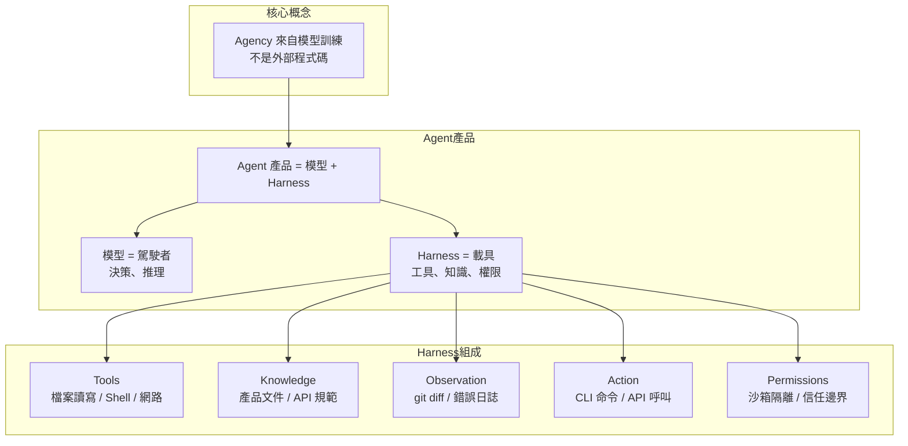
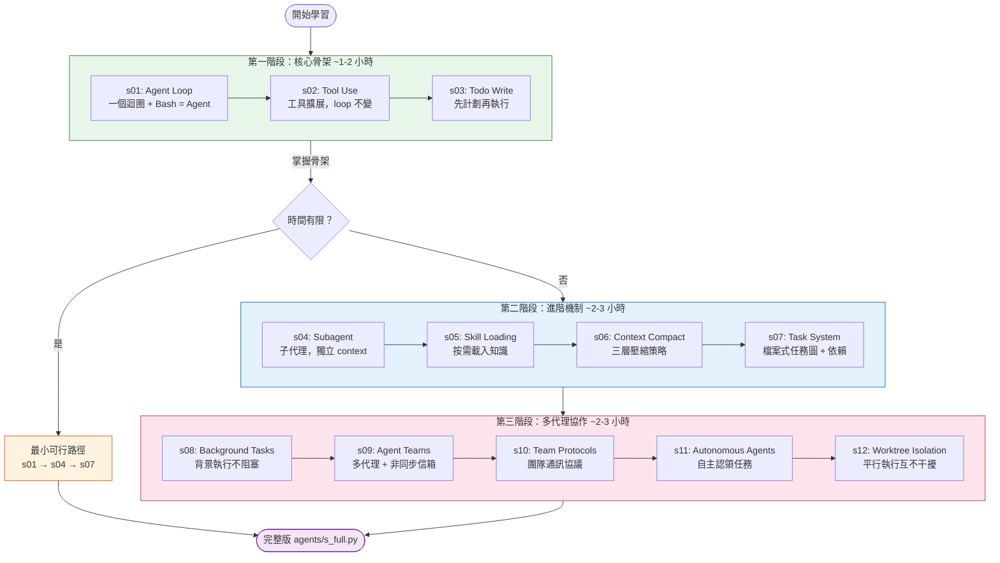
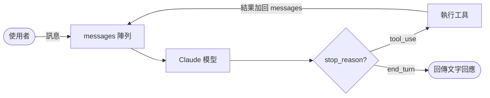
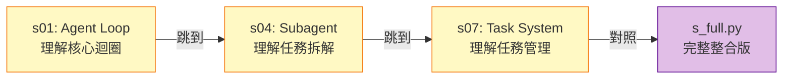

# Learn Claude Code — 最快學習路徑指南（繁體中文）

## 整體架構總覽

---

## 學習路徑流程圖

---

## 核心 Agent Loop 運作流程

---

## 各 Session 對應的 Harness 機制

```mermaid
graph LR
    subgraph 第一階段
        s01[s01<br/>Agent Loop]
        s02[s02<br/>Tool Use]
        s03[s03<br/>Todo Write]
    end

    subgraph 第二階段
        s04[s04<br/>Subagent]
        s05[s05<br/>Skill Loading]
        s06[s06<br/>Context Compact]
        s07[s07<br/>Task System]
    end

    subgraph 第三階段
        s08[s08<br/>Background Tasks]
        s09[s09<br/>Agent Teams]
        s10[s10<br/>Team Protocols]
        s11[s11<br/>Autonomous Agents]
        s12[s12<br/>Worktree Isolation]
    end

    s01 -->|加工具| s02
    s02 -->|加計劃| s03
    s03 -->|加子代理| s04
    s04 -->|加知識| s05
    s05 -->|加壓縮| s06
    s06 -->|加任務| s07
    s07 -->|加背景| s08
    s08 -->|加團隊| s09
    s09 -->|加協議| s10
    s10 -->|加自主| s11
    s11 -->|加隔離| s12

    style s01 fill:#c8e6c9
    style s02 fill:#c8e6c9
    style s03 fill:#c8e6c9
    style s04 fill:#bbdefb
    style s05 fill:#bbdefb
    style s06 fill:#bbdefb
    style s07 fill:#bbdefb
    style s08 fill:#ffcdd2
    style s09 fill:#ffcdd2
    style s10 fill:#ffcdd2
    style s11 fill:#ffcdd2
    style s12 fill:#ffcdd2
```

---

## 最小可行路徑（時間極有限時）

> **只讀 3 個檔案，即可掌握 Claude Code 80% 的設計精髓。**

---

## 每個 Session 的程式碼檔案對照

| 階段 | Session | 程式碼 | 核心概念 | 口號 |
|------|---------|--------|----------|------|
| 核心 | s01 | `agents/s01_agent_loop.py` | Agent Loop | 一個迴圈 + Bash 就是一切 |
| 核心 | s02 | `agents/s02_tool_use.py` | 工具擴展 | 加工具就是加一個 handler |
| 核心 | s03 | `agents/s03_todo_write.py` | 計劃能力 | 沒有計劃的 agent 會漂移 |
| 進階 | s04 | `agents/s04_subagent.py` | 子代理 | 大任務拆小，各用乾淨 context |
| 進階 | s05 | `agents/s05_skill_loading.py` | 知識載入 | 需要時載入，不是一開始就塞 |
| 進階 | s06 | `agents/s06_context_compact.py` | 上下文壓縮 | Context 會滿，你需要騰空間 |
| 進階 | s07 | `agents/s07_task_system.py` | 任務系統 | 大目標拆小任務，排序，持久化 |
| 協作 | s08 | `agents/s08_background_tasks.py` | 背景執行 | 慢操作丟背景，agent 繼續思考 |
| 協作 | s09 | `agents/s09_agent_teams.py` | 代理團隊 | 任務太大就委派給隊友 |
| 協作 | s10 | `agents/s10_team_protocols.py` | 團隊協議 | 隊友需要共同的通訊規則 |
| 協作 | s11 | `agents/s11_autonomous_agents.py` | 自主代理 | 隊友自己掃看板、認領任務 |
| 協作 | s12 | `agents/s12_worktree_task_isolation.py` | 工作樹隔離 | 各做各的目錄，互不干擾 |

---

## 建議的實際操作方式

1. **先跑 `s01`** — 確認你能用 Anthropic API 跑通最小 agent loop
2. **逐個 session 往上疊** — 每個 session 只加一個概念，diff 前後兩個檔案看差異最有效
3. **看完整版 `agents/s_full.py`** — 所有機制整合後的完整版，對照理解全貌
4. **閱讀對應文件** — 每個 session 在 `docs/` 目錄有詳細說明文件
